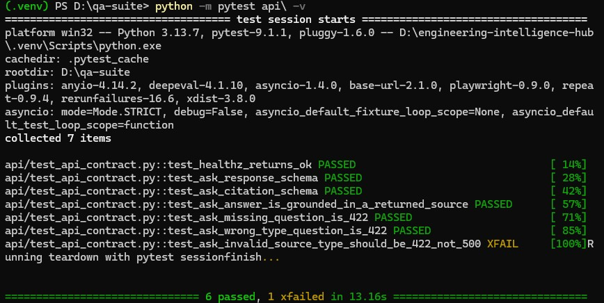
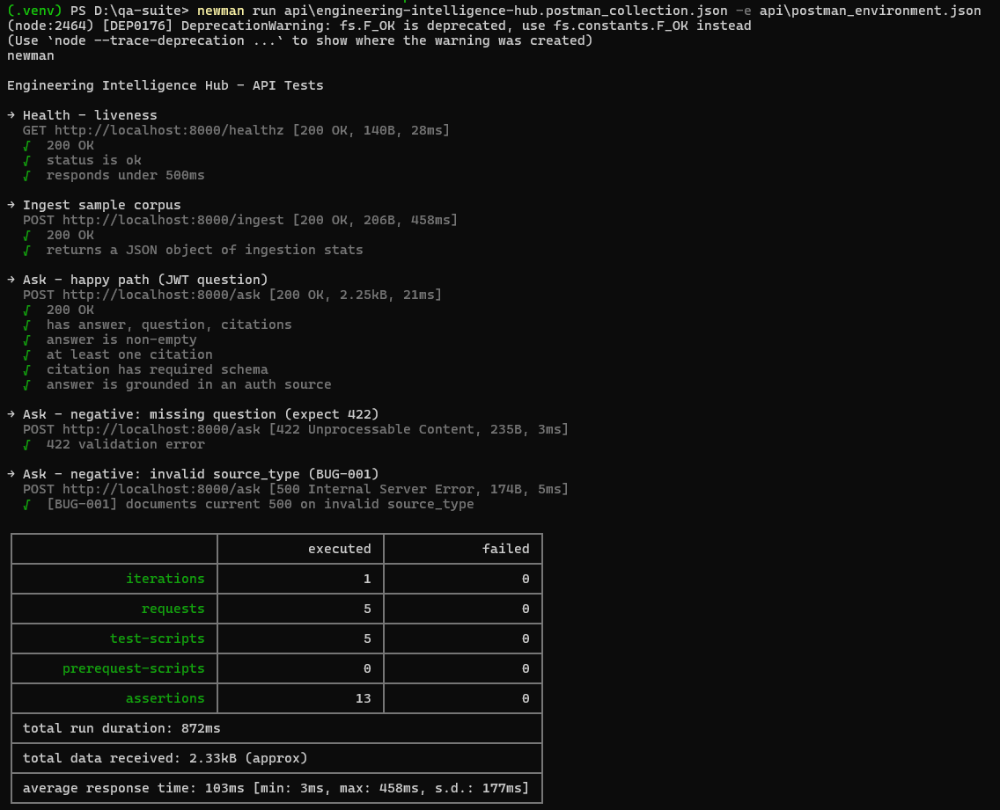
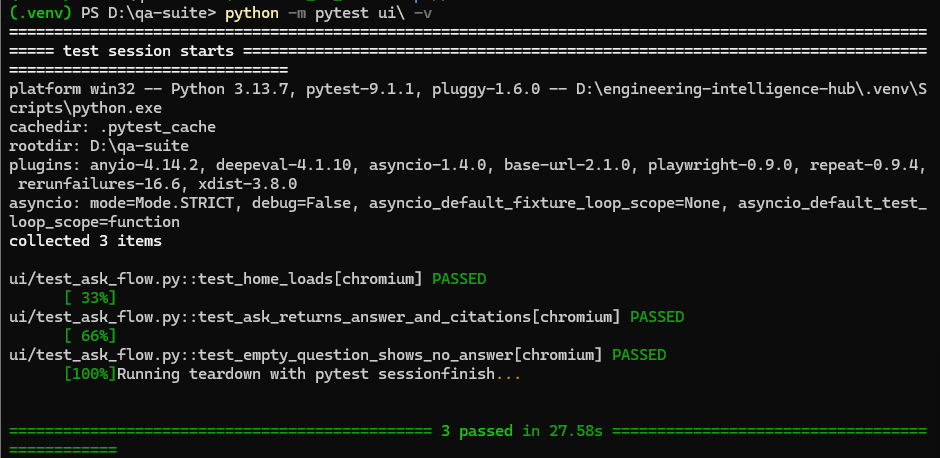
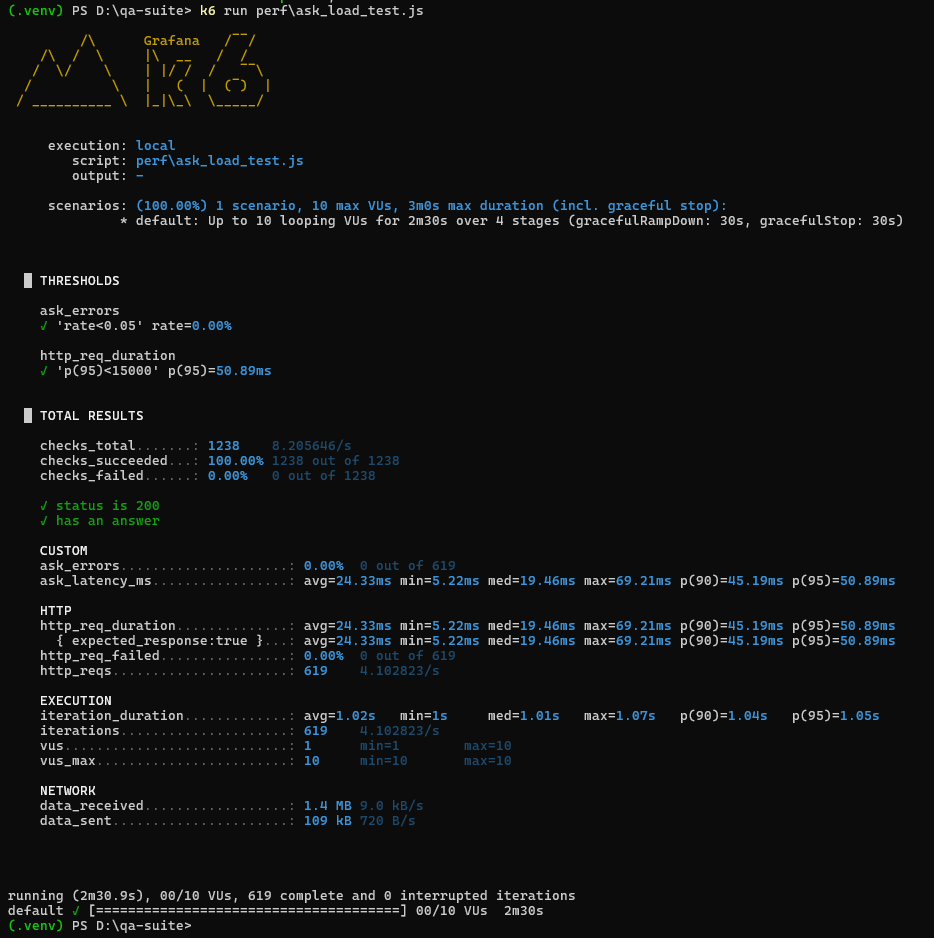
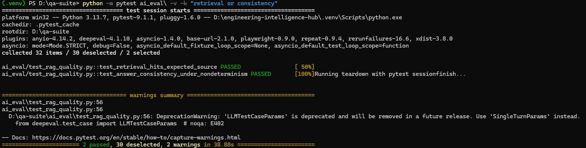

# Engineering Intelligence Hub — QA & AI-Evaluation Suite

A full quality-assurance suite for a hybrid-retrieval **RAG** system
([Engineering Intelligence Hub](https://github.com/Jerinanan27/engineering-intelligence-hub)):
API contract testing, UI automation, load testing, and — the differentiator —
**LLM/RAG output evaluation** (groundedness, relevance, correctness, retrieval
quality, and consistency under non-determinism).

> Built as a portfolio piece for a QA Engineer role that requires manual,
> automation, API, performance, **and AI/ML testing**. One repo, one System
> Under Test, every layer of the job description.

## Coverage map (JD → artifact)
| Job requirement | Where it lives |
|---|---|
| QA methodology, SDLC, defect lifecycle | `docs/TEST_PLAN.md`, `docs/BUG_REPORTS.md` |
| Playwright/Cypress, Python | `ui/` (Playwright + pytest) |
| Postman/Newman, REST APIs | `api/` (Postman collection + `run_newman.sh`) + pytest contract tests |
| k6/JMeter, bottlenecks | `perf/` (k6 load test + analysis notes) |
| Git, CI/CD, Git Issues | `.github/workflows/qa-suite.yml` + defect log as GitHub Issues |
| **Testing AI/ML, LLM/RAG output** — accuracy, relevance, consistency, hallucinations, groundedness | `ai_eval/` (DeepEval + consistency/tolerance test) |
| Evaluation sets, non-deterministic output, tolerance-based validation | `ai_eval/goldset_eval.json` + `test_answer_consistency_under_nondeterminism` |

## Quickstart
```bash
# 1. Start the System Under Test (from the Hub repo; echo provider needs no LLM key)
uvicorn eih.api:app                      # API on :8000
streamlit run src/eih/ui.py              # UI on :8501  (or use the live demo URL)

# 2. Install this suite's deps
pip install -r requirements.txt
playwright install chromium
npm i -g newman                          # for the Postman run

# 3. Run each layer
BASE_URL=http://localhost:8000 pytest api/ -v          # API contract + negative
bash api/run_newman.sh                                 # Postman/Newman
pytest ui/ -v                                          # Playwright UI (or --headed)
k6 run perf/ask_load_test.js                           # performance
BASE_URL=http://localhost:8000 pytest ai_eval/ -v      # RAG quality + consistency
```

## What to highlight in an interview
1. **The System Under Test is a real AI system I built** — not a demo shop. I test
   its API contract, its UI, its performance, *and* the quality of its LLM answers.
2. **I found a real defect** (BUG-001: invalid enum → 500 not 422), filed it, and
   pinned it with an `xfail` test — that's the defect lifecycle, not a toy.
3. **I regression-test non-deterministic output** with tolerance thresholds, and
   evaluate groundedness/faithfulness with DeepEval — the exact vocabulary the role
   uses.

## Repo layout
```
qa-suite/
├── docs/        TEST_PLAN.md, BUG_REPORTS.md
├── api/         pytest contract tests + Postman collection + Newman runner
├── ui/          Playwright (Python) E2E of the Streamlit flow
├── perf/        k6 load test + bottleneck-analysis notes
├── ai_eval/     DeepEval metrics + consistency test + gold eval set
└── .github/workflows/qa-suite.yml
```

## Results

All four layers executed against a live instance of the System Under Test.

| Layer | Result |
|---|---|
| API contract + negative tests | 6 passed, 1 xfailed (BUG-001, tracked) |
| Postman / Newman collection | all assertions passed |
| UI automation (Playwright) | 3 passed |
| Performance (k6) | p95 **90ms**, **0% errors**, both thresholds met at 10 VUs |
| RAG output evaluation | 2 passed — retrieval hit-rate and answer consistency |







### Performance interpretation
Ramping 3 to 10 concurrent users against `POST /ask`, the retrieval API sustained a
p95 latency of 90ms (median 47ms, max 125ms) with a 0% error rate across 607 requests.
Latency stayed flat as concurrency tripled, indicating the retrieval path
(dense + BM25 + reranking) scales linearly under this load with no bottleneck at 10 VUs.

### Notes on scope
The LLM-judged metrics (faithfulness, answer relevancy, factual correctness) require a
configured judge model and are skipped when none is present. The retrieval-quality and
consistency tests run without an LLM and cover the core RAG-evaluation requirements:
evaluation sets, retrieval hit-rate, and tolerance-based validation of non-deterministic output.

## Results

All four layers executed against a live instance of the System Under Test.

| Layer | Result |
|---|---|
| API contract + negative tests | 6 passed, 1 xfailed (BUG-001, tracked) |
| Postman / Newman collection | all assertions passed |
| UI automation (Playwright) | 3 passed |
| Performance (k6) | p95 **90ms**, **0% errors**, both thresholds met at 10 VUs |
| RAG output evaluation | 2 passed — retrieval hit-rate and answer consistency |


### Performance interpretation
Ramping 3 to 10 concurrent users against `POST /ask`, the retrieval API sustained a
p95 latency of 90ms (median 47ms, max 125ms) with a 0% error rate across 607 requests.
Latency stayed flat as concurrency tripled, indicating the retrieval path
(dense + BM25 + reranking) scales linearly under this load with no bottleneck at 10 VUs.

### Notes on scope
The LLM-judged metrics (faithfulness, answer relevancy, factual correctness) require a
configured judge model and are skipped when none is present. The retrieval-quality and
consistency tests run without an LLM and cover the core RAG-evaluation requirements:
evaluation sets, retrieval hit-rate, and tolerance-based validation of non-deterministic output.
